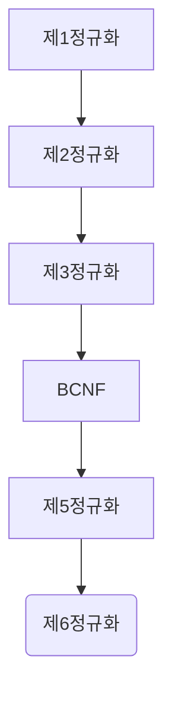

# 데이터베이스 정규화

정규화란 릴레이션에서 이상현상을 제거하는 것이다, 즉 쉽게 말하면 중복된 데이터를 제거함으로써
무결성을 유지할 수 있고 DB의 용량을 줄일수 있다

## 이상현상
이상 현상으로는 3가지 경우가 있다.
이상 현상을 설명하기 위해 다음과 같은 테이블이 있다고 가정하자.

기본키 : (STUDENT_ID, COURSE_ID)

| STUDENT_ID | STUDENT_NM |  DEPARTMENT  | COURSE_ID | GRADE |
|:----------:|:----------:|:------------:|:---------:|-------|
|  20800399  |    학생1     | 컴퓨터공학부 | CSE011101 | A+    |
|  20800399  |    학생1     | 컴퓨터공학부 | CSE022202 | A     |
|  20800399  |    학생1     | 컴퓨터공학부 | CSE033303 | B+    |
|  21300758  |    학생2     |   경영학부   | MEC011101 | F     |
|  21400001  |    학생3     |  기계공학부  | POD032939 | C+    |

### 삽입 이상
위 테이블에서 과목을 하나도 수강하지 않은 학생이 있다고 가정하자, 이 튜플을 삽입할때
COURSE_ID는 NULL 값이 될것이다, 기본키값은 NULL이 될수 없으므로 이 튜플을 삽입하려면
"미수강" 같은 과목코드를 새로 삽입하여야 한다.

##### 새로운 튜플을 삽입하기 위해 불필요한 데이터 까지 삽입해야 하는 문제

### 갱신 이상
위 테이블에서 학생1이 전과를 하는경우 학생1에 대한 모든 튜플의 DEPARTMENT를 바꾸어야 한다
만일 단일 튜플에 대해서만 변경한다면 학생1에 대한 DEPARTMENT를 구별할 수 없다.

##### 중복 튜플 중에서 일부만 변경하여 값의 불일치가 생기는 문제

### 삽입 이상
위 테이블에서 학생2의 경우 한개의 과목만 수강하고 있다, 학생2가 수업을 듣지 않는 경우
학생4에 대한 튜플을 삭제하여 학생2에 대한 정보는 남아있지않다, 수강취소를 반영하기 위해
학생 정보를 삭제하는 셈이다.

##### 튜플을 삭제할때 필요한 정보까지 같이 삭제되는 문제

이상현상이 발생하는 이유는 정규화가 되어 있지 않는 테이블 설계 때문이다, 코드를 설계할 때에도
관심사의 분리를 통해 코드의 재 사용성과 유지보수 측면에서 이점을 가질수 있다, 데이터베이스에서도
관심사를 분리하지 않아 생기는 문제는 휠씬 치명적이라고 할 수 있다.

정규화를 수행하기 위해선 함수의 종속성에 대해 알아야 할 필요가 있다.
일반적으로 하나의 릴레이션에는 하나의 종속성을 지니는것이 보통이다.

## 함수의 종속성
일반적으로 종속성은 다음과 같이 표기한다.

X -> Y
* X : 결정자, Y : 종속자
* X가 Y를 결정하고 Y는 X에 종속 되어 있다.

종속은 다음과 같이 부분 종속과 완전 종속이 있다.
* 부분 함수적 종속 : Y가 X의 전체가 아닌 일부분에 종속되어 있는 상태
* 완전 함수적 종속 : Y가 X의 전체에 대해서만 종속되어 있는 상태

## 정규화 과정
정규화는 다음과 같은 과정으로 이루어진다.

### 제 1정규화
도메인 값은 오직 1개만 할당 되어야 합니다, 이를 원자성 이라고 합니다, 제 1정규형에서는 
원자성을 보장 하기위한 정규화 과정입니다.

다음과 같은 비정규형 릴레이션이 있을때 제 1정규형을 시행하는 과정입니다.

| 회원번호 | 성명  | 연락처   |
|----------|-------|----------|
| 001      | 회원1 | 000, 001 |
| 002      | 회원2 | 100,101  |

연락처에 대한 도메인 값이 중복되어 원자성을 위반합니다, 제 1정규형 에서는 새로운 튜플을 삽입하여
원자성을 보장합니다.

| 회원번호 | 성명  | 연락처 |
|----------|-------|--------|
| 001      | 회원1 | 000    |
| 001      | 회원1 | 001    |
| 002      | 회원2 | 100    |
| 002      | 회원2 | 101    |

### 제 2정규화
제 1정규화를 만족하고 기본키에 해당하지 않는 모든 속성이 기본키에 완전 함수적 종속을 만족하여야 합니다.

| 학번 | 과목번호 | 학년 | 성적 |
|------|----------|------|------|
| 001  | 500      | 3    | A+   |
| 001  | 501      | 3    | A    |
| 002  | 500      | 1    | B    |
| 003  | 501      | 2    | A    |

이 릴레이션에 대한 기본키는 (학번, 과목번호) 입니다, 성적 속성은 기본키에 대해 완전 함수적 종속을
만족하지만 학년 속성의 경우 학번 속성에만 종속 관계를 이루고 있습니다, 따라서 제 2정규형에서는
모든 속성이 기본키에 완전 함수적 종속을 만족하기 위해 릴레이션을 분해합니다.

| 학번 | 과목번호 | 성적 |
|------|----------|------|
| 001  | 500      | A+   |
| 001  | 501      | A    |
| 002  | 500      | B    |
| 003  | 501      | A    |

| 학번 | 학년 |
|------|------|
| 001  | 3    | 
| 001  | 3    |
| 002  | 1    |
| 003  | 2    |

### 제 3정규화
제 2정규화를 만족하고 기본키에 해당하지 않는 모든 속성이 기본키에 이행적 함수 종속이 아닌 상태입니다.

### 제 3정규화
제 2정규화를 만족하고 기본키에 해당하지 않는 모든 속성이 기본키에 이행적 함수 종속이 아닌 상태입니다.
이행적 함수 종속이란 함수 종속이 X-Y, Y->Z 같은 관계를 말합니다.

### BCNF 정규화
릴레이션의 모든 결정자가 후보키를 만족합니다, 모든 속성이 모든 후보키에 대해 함수 종속 관계를 유지합니다.

이외의 제 5정규화, 제 6정규화가 있지만 실무에선 잘 쓰이지 않습니다. 